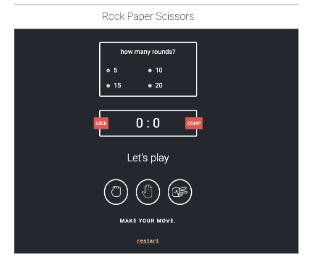

Gruppenprojekt: Schere, Stein, Papier

👨‍💻 - [Pass80](https://github.com/Pass80) - 🖥️
👨‍💻 - [Straskie](https://github.com/Straskie) - 🖥️
👨‍💻 - [jennijennina](https://github.com/jennijennina) - 🖥️

## 🎓 Aufgabe

Aufgabenstellung

```
Jeder hat in seinem Leben schon einmal "Rock, Paper, Scissors" (Schnick, Schnack, Schnuck) gespielt. Ihr kennt die Regeln also bereits. ;)

Definiere, wie viele Runden ein Unser gegen den Computer spielen wird.
Die Farbe sollte sich ändern, wenn es sich um einen Gewinn, ein Unentschieden oder eine Niederlage handelt.

Das Design im Anhang ist nur ein Vorschlag, ihr könnt hier gerne kreativ werden. ;)


Zusatz: Page ist komplett Responsive

```

## 📸 Screenshots



## 💻 Running

Zur Seite —> - [Projekt Gruppe_Schere_Stein_Papier](https://github.com/jennijennina/Projekt_Schere_Stein_Papier/deployments/activity_log?environment=github-pages)

<p align="left">
</p>

<h3 align="left">Languages and Tools:</h3>
<p align="left"> <a href="https://www.w3schools.com/html/" target="_blank" rel="noreferrer">  </a>
<a href="https://www.w3schools.com/css/" target="_blank" rel="noreferrer">  </a>
<a href="https://www.w3schools.com/css/" target="_blank" rel="noreferrer">  </a> </p>
```
